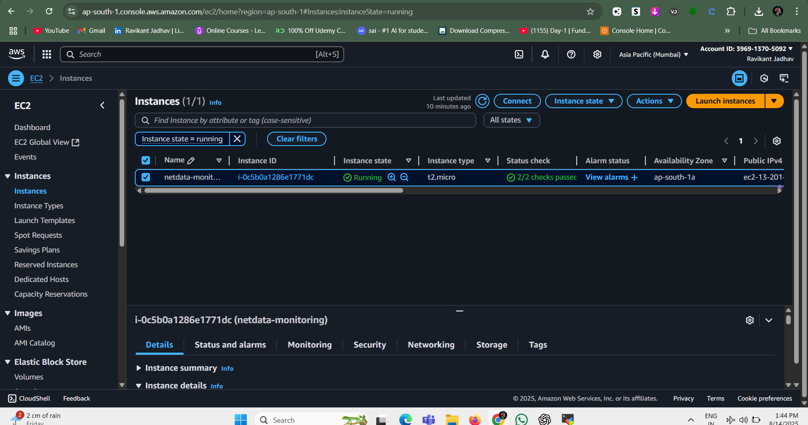
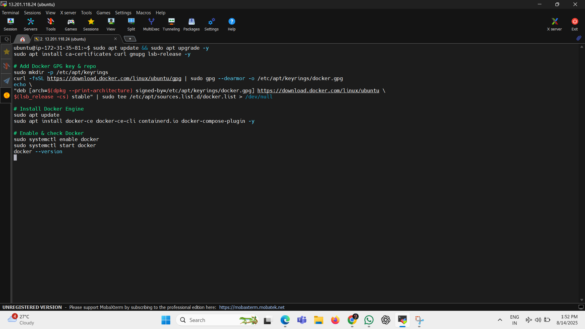
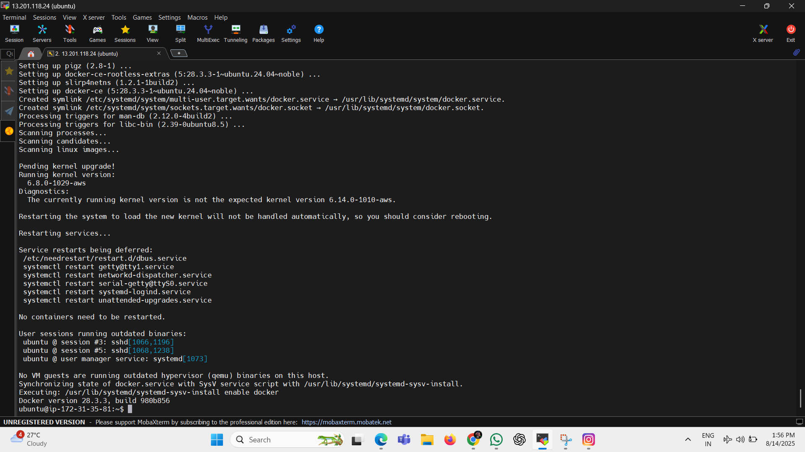
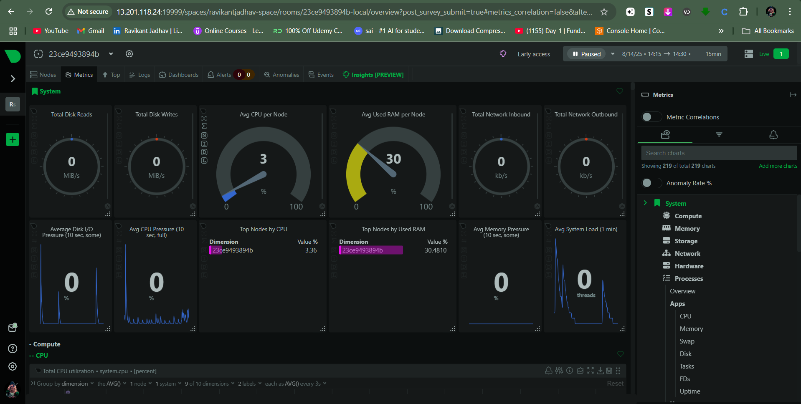
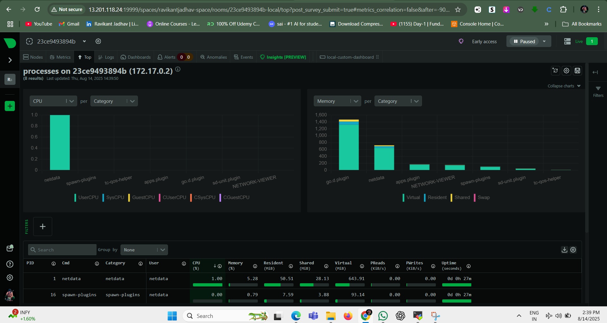
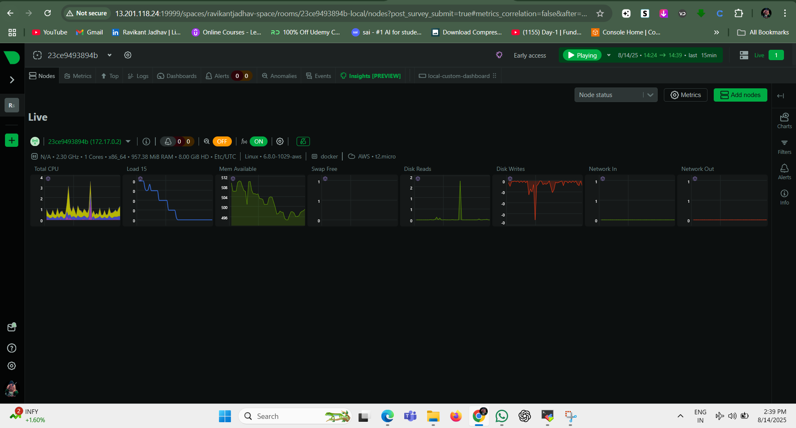
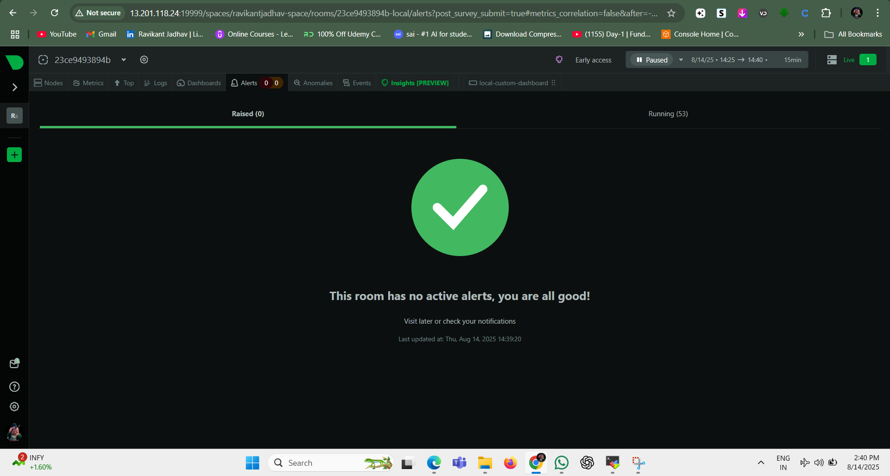

📊 Netdata Monitoring using Docker on AWS EC2
📌 Overview

This project demonstrates how to set up Netdata in Docker on an AWS EC2 Ubuntu instance for real-time monitoring of CPU, memory, processes, alerts, and more.
Netdata provides a beautiful web-based dashboard for system performance monitoring.

🛠 Tools & Technologies

AWS EC2 – 24.04 LTS (HVM) instance

Docker – Container runtime to run Netdata

Netdata – Real-time performance monitoring tool

🚀 Step-by-Step Guide
1️⃣ Launch AWS EC2 Instance

Go to AWS Management Console.

Launch a new Ubuntu 22.04 LTS instance.

Open port 19999 in the security group for Netdata access.

📸 Screenshot:



2️⃣ Install Docker on Ubuntu

Run the following commands to install Docker:
```
sudo apt update
sudo apt install -y docker.io
sudo systemctl start docker
sudo systemctl enable docker
```

📸 Screenshot:



3️⃣ Verify Docker Installation

```
docker --version
```

📸 Screenshot:



4️⃣ Run Netdata Container
sudo docker run -d --name=netdata -p 19999:19999 \
  --cap-add SYS_PTRACE --security-opt apparmor=unconfined \
  netdata/netdata

  

5️⃣ Access Netdata Dashboard

In your browser, visit:
```
http://<EC2-Public-IP>:19999
```

You’ll see live CPU, memory, disk, and network monitoring.

📸 Screenshot:



6️⃣ Explore Key Netdata Features
🔹 Top Processes

View CPU & memory usage by process.
📸 Screenshot:



🔹 Nodes Page

View connected nodes and system info.
📸 Screenshot:



🔹 Alerts Page

Monitor active alerts and trigger conditions.
📸 Screenshot:



7️⃣ Viewing Netdata Logs

You can check logs from inside the container:

```
sudo docker exec -it netdata ls -l /var/log/netdata
```


📸 Screenshot:


🎯 Conclusion

By following these steps, you can easily set up Netdata on AWS EC2 using Docker and monitor your system in real-time with an interactive dashboard.
This setup is ideal for DevOps engineers, system admins, and cloud practitioners who want lightweight yet powerful monitoring.


